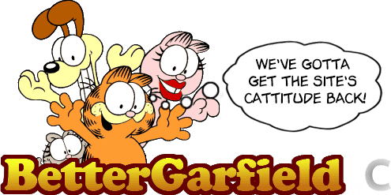

  
_A userstyle for Garfield.com to improve the visual quality and user experience_  
  

# Features
This style includes a variety of changes, including:
* A wider page
* Removal of ads*
* Larger games
* Slight increase in aesthetic pleasing
* Some easter eggs hidden
* Hiding some annoying things
* Better list pages (like the games page)
* Fixing a random typo
* Compacting some things
* Commented code for ease of modification
* And definitely more to come!

_\*ads will still load (unless you have an ad blocker), but they will not be visible and will allow more room for what you actually care about. if you still want to support them but don't want ads in your way, this is a win-win._

# Download
This is only available in the UserCSS format. If you know what that means, then you can move on.  
Rest of you, all you need to know is that you need to use Stylus. Get it [here for Chrome](https://chrome.google.com/webstore/detail/stylus/clngdbkpkpeebahjckkjfobafhncgmne) and [here for Firefox](https://addons.mozilla.org/en-US/firefox/addon/styl-us/).

 

# Feedback / Bug Reports
Found a evil little bug? Think something should've been different? Just want to express your love?  
All of those things can be done on...  
### _**[The Issues Page!](https://github.com/CommenterOfComments/BetterGarfield/issues/new/choose)**_

That's right, on The Issues Page™, you can instantly send me any sort of feedback about BetterGarfield!  
By clicking on the large "The Issues Page™" you can pick a template, and type out what you desire to say!  
Thanks to The Issues Page®, we can learn what everyone wants from this project, and try to add it!

Due to this, it's advised that if you want something changed, rather than simply modifying your copy and being done, you should (also?) use The Issues Page® to start a discussion about what you don't like about it.  
If you do that, then we can try to add it in some form, and make _everyone's_ experience better! It's only a minute out of your day, and it benefits a whole community!

# "How can I help?"
Ah, you have decided to help make BetterGarfield better! Thank you so much!  
In this case, you can read the [Contribution Guide](CONTRIBUTING.md) to learn what you need to do!  
However, the TL;DR is:
* Have a basic knowledge of CSS
* Fork the repository
* Make your changes to the style
* Submit a pull request!

